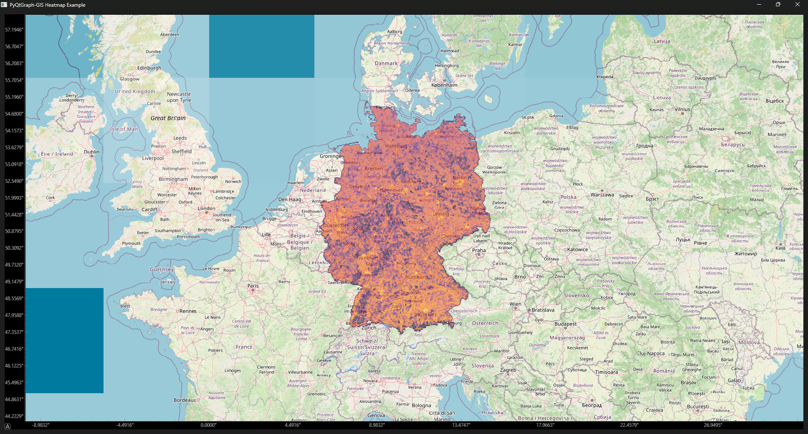

# 2D Array Heatmap

In this example we will display the 5G network coverage in Germany as a Heatmap.

## Get the Data

The data is provided by the german Federal Network Agency on
their [Downloads](https://gigabitgrundbuch.bund.de/GIGA/DE/Downloads_Suche/start.html) page. Here we can get a `.gpkg`
file of the current coverage by technology. This file can be read with the [GeoPandas](https://geopandas.org/en/stable/)
library.

## Create the app

With the data downloaded we can now create the app.
As the tile server we will use [OpenStreetMap](https://tile.openstreetmap.org).
When using OpenStreetMap, make sure to include your app and contact details in the header and insert an attribution to
the provider in the map, as per their [Tile Usage Policy](https://operations.osmfoundation.org/policies/tiles/).

```python
from PyQt6 import QtWidgets, QtCore
import geopandas as gpd
import numpy as np
import pyogrio

import pyqtgraph_gis as pggis
import pyqtgraph as pg

path
"Path/To/File.gpkg"

app = QtWidgets.QApplication([])
w = QtWidgets.QWidget()

# Make sure to enter your app name and contact details when using OpenStreetMap
headers = {
    "User-Agent": "MyMapApp/1.0 (contact: email@example.com)"
}

# Set up window and widgets
w.setWindowTitle("PyQtGraph-GIS Heatmap Example")
layout = QtWidgets.QGridLayout()
w.setLayout(layout)

# Use OpenStreetMap Tile Server
widget = pggis.MapWidget("https://tile.openstreetmap.org/{z}/{x}/{y}.png", headers=headers)

# Read data with GeoPandas
layer_names = [info[0] for info in pyogrio.list_layers(file_path)]
coords_list = []
col = 'nr'  # 5G coverage column in the GPKG

for state in layer_names:
    gdf = gpd.read_file(file_path, layer=state, columns=[col], engine="pyogrio")
    gdf = gdf[gdf[col] > 0].to_crs(epsg=3857)

    # Extract centroids as simple floats
    x = gdf.geometry.centroid.x.values
    y = gdf.geometry.centroid.y.values
    vals = gdf[col].values

    # Append as a single numpy block
    coords_list.append(np.column_stack([x, y, vals]))
    print(f"Processed {state} ({len(x)} points)")

# Final array of all German points
stack = np.vstack(coords_list)

heatmap, xedges, yedges = np.histogram2d(
    stack[:, 0],  # x (longitude in Web Mercator)
    stack[:, 1],  # y (latitude in Web Mercator)
    bins=500,
    weights=stack[:, 2]  # 'nr' values
)

# Create a heatmap image using PyQtGraph's colormap
heatmap_cmap = pg.colormap.get('inferno')
max_val = np.max(heatmap)
img = pg.ImageItem(heatmap)
normalized_data = heatmap / max_val
rgba_image = heatmap_cmap.map(normalized_data, mode='byte')
rgba_image[heatmap == 0, 3] = 0
img.setImage(rgba_image, autoLevel=False)

# Set the correct geographic bounds for the heatmap
rect = QtCore.QRectF(xedges[0], yedges[0], xedges[-1] - xedges[0], yedges[-1] - yedges[0])
img.setRect(rect)
img.setOpacity(0.6)  # Semi-transparent heatmap

# Add the heatmap to the map widget
widget.addItem(img)

layout.addWidget(widget, 0, 0)
w.show()
app.exec()
```

The result should look like this:

