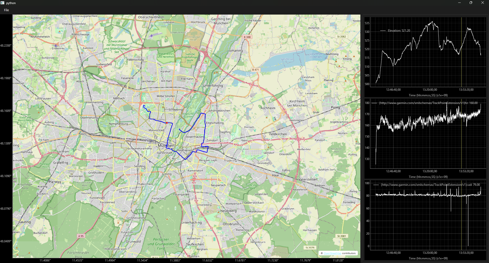

# Examples

In this section you can find code examples for using the library in different scenarios.

Please note that these examples may skip some steps, especially when getting and preparing the data, since the goal of
these examples is to explain how to use PyQtGraph-GIS and how the syntax works.

## 2D Array Heatmap

In [this example](./2d-array-heatmap.md) we will display the 5G network coverage in Germany as a Heatmap.
The result will look like this:

## GPX Viewer

In [this example](./gpx-viewer.md) we will display a GPX file on a map and plot additional data in normal PyQtGraph plots on the side.
With signals and slots we will link the map and the plots together, so when you hover over a plot, the corresponding point on the map will be highlighted.

The result will look like this:

